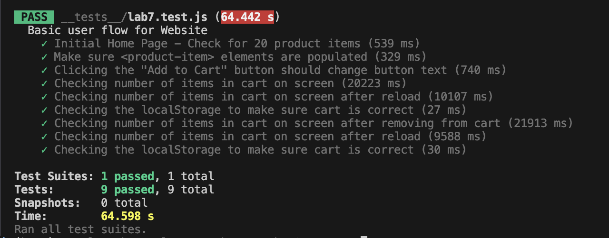

# Lab 7 - Unit & E2E Testing

**Name:** Yuval Pesok

## Test Results

All 9 tests pass.

---

## Check Your Understanding

### 1. Where would you fit your automated tests in your Recipe project development pipeline?

**Answer: (1) Within a GitHub Action that runs whenever code is pushed.**

Using github actions whenever code is pushed ensures that the tests are automtically ran immediately as the code gets pushed so that no broken code or failed tests can make it to the main branch. This is important because relying on the developer to run the tests themsevles locally is prone to running into issues (claude code being leaked is a great example of this). Code is always being pushed by many developers, its very likely that someone might forget to run the tests. Also waiting until development is completely finished pretty much defeats the overall pupose of testing. This is because bugs should be tested for as soon as a new feature is created, because if you ignore the bugs from the beggining they can just exponentially grow as you continue to develop. Using a CI pipeline that automatically runs the tests that are developed as features are created gives the whole team more resiliance and a single source of truth.

### 2. Would you use an end-to-end test to check if a function is returning the correct output?

**Answer: No.**

I would not use an E2E test to check if a single function is returning a correct output. This is because E2E tests are slow and operate at the level of testing user input from start to finish. Checking a single function's return value is the job of a unit test, which runs much quicker and can isolate the function from everything else, an E2E test would be too overkill.

### 3. What is the difference between Lighthouse Navigation mode and Snapshot mode?

The main difference between Navigation mode and Snapshot mode is when they actually analyze the page. Navigation mode runs the audit right after the page loads, so it can measure the initial load experience like the performance, Core Web Vitals, and SEO. The downside is that it cant analyze any user interactions or any changes to the DOM that happen after the page is already loaded. Snapshot mode on the other hand analyzes the page in whatever state it is currently in when you run the audit, which makes it much better for catching accessibility issues in a specific UI state. The tradeoff with snapshot is that it cant analyze JS performance or any changes to the DOM over time since its just looking at one frozen moment. So basically Navigation is for measuring how the page loads, and Snapshot is for measuring whats currently wrong with the page right now.

### 4. Name three things we could do to improve the CSE 110 shop site based on the Lighthouse results.

1. Add a `<meta name="description">` tag to the index.html. Lighthouse specifically flagged "Document does not have a meta description" as a failed SEO audit, which is the reason the SEO score is sitting at 91 instead of 100. This is because search engines use the meta description to understand what the page is actually about, so without one the page is harder to index properly. Adding a description tag would directly fix this issue and bump up the SEO score.

2. Get rid of the render-blocking main.css file. Lighthouse flagged `assets/styles/main.css` under render-blocking requests, which basically means that the browser has to wait for the css file to fully download before it can render anything on the page. This is bad because it makes the page take longer to actually show up to the user. Since the css file is only 1 KB, the easiest fix would be to just inline the css directly into the `<head>` of the index.html, or load it asynchronously so it doesnt block the render. This would lower the LCP and FCP times.

3. Set longer cache lifetimes for the static assets. Lighthouse flagged "Use efficient cache lifetimes" and showed that all of the static files (main.js, main.css, storage.js, product-item.js, shop-icon.png) are only being cached for 10 minutes which is way too short. For assets that dont really change that often, the cache TTL should be set way longer (like a year). This wouldnt do anything for the first visit but it would make the site load way faster for anyone whos coming back to it since they wouldnt have to redownload everything.
